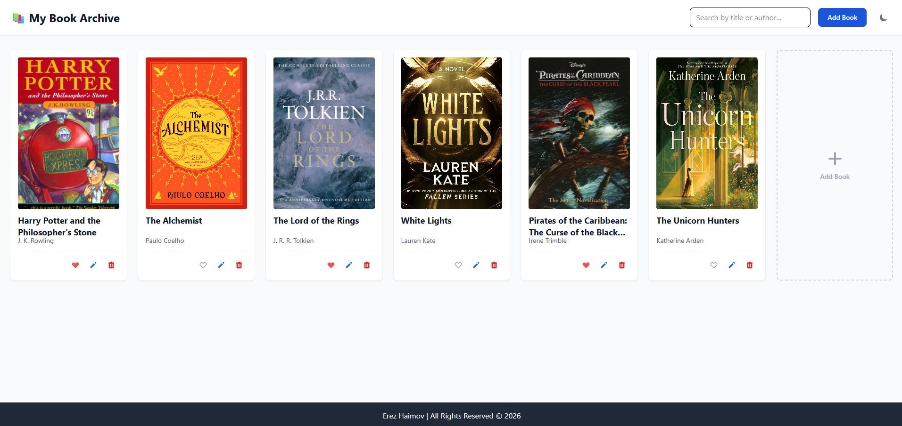
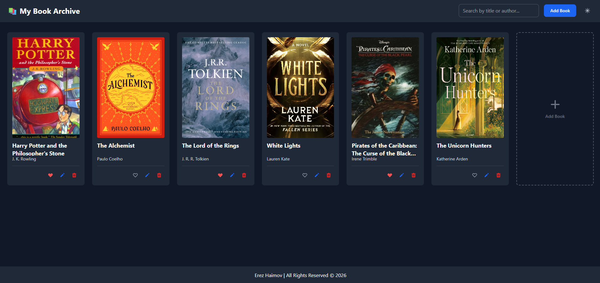

# My Book Archive

This Book Archive project demonstrates a **production-minded frontend approach** to application development.
Beyond front-end design, it involves **API integration** to create, read, update, and delete personal book records, complex **state management** for CRUD operations with optimistic UI updates, and a responsive, card-based catalog UI.
It highlights my ability to build a fully functional single-page application that bridges the gap between raw data and a responsive, user-centric interface.

## Useful navigation

- [Overview](#overview)
  - [The challenge](#the-challenge)
  - [Screenshot](#screenshot)
  - [Links](#links)
- [Getting Started](#getting-started)
- [Features](#features)
- [My process](#my-process)
  - [Technologies](#technologies)
  - [Ongoing Development](#ongoing-development)
  - [Useful resources](#useful-resources)
- [Author](#author)

## Overview

### The challenge

- **CRUD & Persistence:** Implement Create, Read, Update, and Delete functionality against a mock REST API, so changes are reflected both on the server and in the UI in real time.
- **API Integration:** Fetch the initial book catalog from an external mock REST API (MockAPI) and map it into the application's internal data structure.
- **Dynamic Catalog:** Display books as styled cards (image, title, author, action buttons) in a responsive grid, with a hover/tap overlay revealing the book's description.
- **Favorites System:** Toggle a book's "favorite" status with a heart icon, using an optimistic UI update so the interface responds instantly while the request completes in the background.
- **Client-side Search:** Filter the catalog in real time by book title or author as the user types.
- **Safe Deletion:** Require explicit confirmation via a modal dialog before deleting a book, to prevent accidental data loss.
- **Form Validation:** Validate required fields and ensure the cover image field contains a properly formatted URL before allowing submission.
- **Responsive Grid Design:** Utilize CSS Grid with `auto-fill`/`minmax` for a fluid, column-based layout that adapts smoothly across mobile and desktop devices, with a dedicated "add book" card at the end of the catalog.
- **Dark/Light Mode:** A theme toggle with persistence across sessions and smooth color transitions between modes.
- **Modal-based Forms:** Add and edit books through a keyboard-accessible modal form (tab navigation, auto-focus), without navigating away from the single-page catalog view.

### Screenshot




### Links

- Live Site URL: [https://ErezHaimov.github.io/Erez-Haimov-Book-Archive/](https://ErezHaimov.github.io/Erez-Haimov-Book-Archive/)
- Repository: [https://github.com/ErezHaimov/Erez-Haimov-Book-Archive](https://github.com/ErezHaimov/Erez-Haimov-Book-Archive)

## Getting Started

Clone the repository and install dependencies:

```bash
git clone https://github.com/ErezHaimov/Erez-Haimov-Book-Archive.git
cd Erez-Haimov-Book-Archive
npm install
npm run dev
```

The app should be available at `http://localhost:5173`.
Check your terminal output to confirm the exact port, in case 5173 is already in use.

> Note: The app expects a MockAPI resource named `books` with fields `title`, `author`, `description`, `coverImage`, and `isFavorite`. Update the `baseURL` in `src/services/api-service.ts` with your own MockAPI endpoint before running.

## Features

- Add, edit, and delete books from a personal catalog
- Confirmation dialog before any delete action, to prevent accidental data loss
- Mark/unmark books as favorites with a live-updating heart icon, using optimistic UI updates
- Real-time search/filter by book title or author
- Responsive, fluid card-based grid layout with a 2:3 book-cover aspect ratio
- A dedicated "+" card at the end of the catalog for quickly adding a new book
- Description overlay shown on hover (desktop) or tap (mobile) for each book card
- Automatic fallback image when a cover image is missing or fails to load
- Client-side validation of required fields and cover image URL format
- Initial catalog data fetched from an external REST API (MockAPI)
- Modal-based, keyboard-accessible forms for creating and editing books (tab navigation, closable via X, backdrop click, or Escape)
- Loading spinner, retry-on-error handling, and non-blocking on-screen error banners for all API operations
- Dark/Light mode toggle with persistence across sessions and smooth color transitions

## My process

### Technologies

- **React** – For building a component-based, single-page application.
- **TypeScript** – For type-safe data models (`BookRequest` / `BookResponse`) and safer API integration.
- **Vite** – As the build tool and development server.
- **Tailwind CSS** – For utility-first, responsive styling, including class-based dark mode.
- **Flowbite React** – For pre-built, accessible UI components (Cards, Modals, Inputs, Spinner, Dark Mode Toggle).
- **Axios** – For a centralized, configurable API service layer (base URL, timeout, headers).
- **React Icons** – For intuitive UI iconography (favorite heart, edit, delete, info, add).
- **MockAPI** – As a mock REST backend with persistent, database-backed storage.

### Ongoing Development

I plan to extend this project with the following improvements:

- Sorting the catalog (by title, author, or favorite status)
- Pagination or infinite scroll for larger catalogs
- Unit tests for core logic functions (API service, filtering, validation)

### Useful resources

- [MockAPI](https://mockapi.io/) - Used for creating and hosting the mock `books` REST resource.
- [Flowbite React](https://flowbite-react.com/) - For ready-made, accessible UI components.
- [Tailwind CSS](https://tailwindcss.com/) - For utility-based responsive styling.
- [React Icons](https://react-icons.github.io/react-icons/) - For UI iconography.
- [Picsum Photos](https://picsum.photos/) - For placeholder book cover images.

## Author

- GitHub - [ErezHaimov](https://github.com/ErezHaimov)
- LinkedIn - [erez-haimov](https://www.linkedin.com/in/erez-haimov/)
